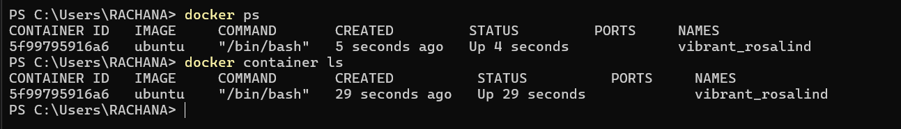
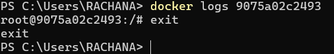

# DockerProject

This includes all learning materials and project code for learning basic docker

When I have 2 different versions of my application using different versions of node say 16 and 18, then it is difficult to create such environment running both node versions, in such cases containers are helpful
Difference between VM and container

1. VM is wherein in a machine, we install 3 different guest OS which is managed by an hypervisor. On each guest os we can run one application4
   High impact on OS, slower, high disk space usage
   Sharing, re-building, distrubution
2. Container is wherein in a single machine, on a single os we run different applications as isloated

We cannot directly run linux based containers on windows host, because containers don't have kernel, od so they are dependent on host os and kernel
second is because of licensing, the containers use same license as host
So in order to run linux based containers on widnows we use docker desktop which is integrated with Windows subsystem for linux(wsl) which creates a linux kernel to run linux containers

Docker is a platfom which allows us to create containers thereby allows us to build, test and deploy applications quickly

Using docker we can ship code faster, it also gives control over applications

Docker commands

1. docker run hello-world -> pull image from registry and creates a container out of it and runs it
2. docker run -it ubuntu:22.04 -> pulls / form local gets ubuntu 22.04 image and runs it in interactive(-it) shell
   
3. If you have one container running from ubuntu 22.04 image, and you do docker run -it ubuntu in another shell, then that will start anothe container
4. To attach the shell to the same container, like having 2 shells for same container use the command below
   docker container exec -it hsahdshhu(from root@**hsahdshhu**) bash
5. To stop a container docker stop $id(hsahdshhu)
6. To get list of all containers including which are stopped
   docker ps -a
7. To remove a container,
   docker rm id(hsadshhu)
8. To get all details of a container
   docker inspect id
9. To get logs from a container
   docker logs id
   
10. To delete all stopped containers
    docker container prune -f
11. To specify commands to run just after container comes up
    docker run -d alpine ping www.hpe.com( -d for detached mode, that is the container will run in background, and logs can be retrieved through docker logs id)
    docker run ubuntu echo 'Heyy'( just run command shows the output of containe in the present shell itself)
12. Port forwarding
    docker run -d -p 8080:80 nginx -> listen to port 8080 on local host and forward to port 80 of container running nginx
13. Only first 4 characters of container id could be used to stop, or get logs -> docker stop h4h3 from h4h3q3njsdk
    14 To start a container again, use
    docker start id
14. Follow below steps, to create an image from container and run it
    a. Say i have created a container using
    docker run -it ubuntu
    touch names.txt
    echo "My Name is Rachana" >> names.txt
    cat names.txt -> shows names.txt content
15. To remove images
    docker rm id
    To get all ids pf images
    docker images -q
    To remove all images
    docker rmi $(docker images -q)
16. Layers
    When you execute
    docker run hello-world
    This command downloads multiple layers
    Each layer is some required software, so if another container image present in my local is already uding the layer, then the new image will say the layer already exists, and will download other dependency layers
